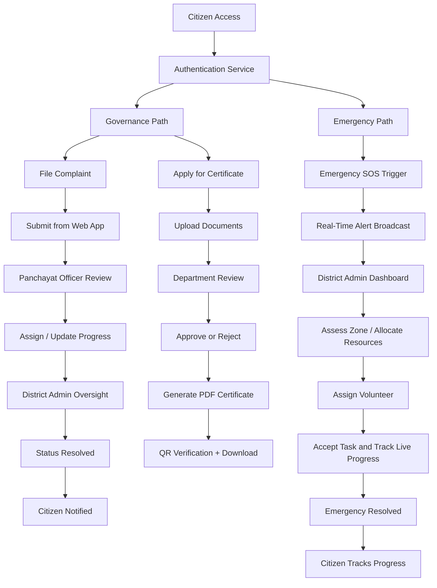

# Smart Rural Governance & Emergency Management System

This project manages two connected public-service workflows:

1. Governance services, where citizens file complaints and apply for certificates.
2. Emergency services, where citizens trigger SOS alerts and officials coordinate response and field updates.

The system is built around role-based access, application review, document generation, and live status tracking.

## Project Details

The application is organized around these user roles:

- Citizen: submits complaints, applies for certificates, checks status, and downloads approved documents.
- Panchayat Officer: reviews complaints, checks incoming work, and assigns follow-up action.
- District Admin: handles escalations, assigns workers or volunteers, and updates progress.
- Volunteer / Response Team: receives emergency or field tasks and reports live progress.

The main functional areas are:

- Complaint intake with photos, category selection, and location capture.
- Certificate applications with document upload, review, approval, QR-based verification, and PDF download.
- Emergency SOS handling with alert propagation, district coordination, task assignment, and progress updates.
- Status visibility through dashboards and live updates.

## Project Flow

### Governance Flow

1. The citizen signs in and chooses either complaint filing or certificate application.
2. A complaint is submitted with supporting details and stored for official review.
3. The panchayat officer reviews the request and updates or assigns it if action is needed.
4. The district admin can take over, assign a worker, and mark the case as resolved.
5. For certificates, the request moves through verification and approval.
6. Once approved, the system generates a PDF certificate with verification support.
7. The citizen downloads the approved certificate and can verify it later using the public verification route.

### Emergency Flow

1. The citizen triggers an SOS alert from the emergency entry point.
2. The alert is routed to the emergency coordination layer for immediate handling.
3. Officials receive the alert, assess the zone, and assign a volunteer or field responder.
4. The assigned responder accepts the task and updates the live progress.
5. Once the situation is handled, the emergency case is marked resolved and the citizen can track progress.

## Flow Chart



## Key Outputs

- Complaint records with attachments and status history.
- Certificate PDFs with QR-based verification.
- Dashboard updates for officers and admins.
- Live emergency handling visibility for response coordination.

## Project Structure

- `client/` - user-facing application and dashboards
- `server/` - API, review logic, document generation, and status handling

## Run Locally

### Backend

```bash
cd server
npm install
npm run dev
```

### Frontend

```bash
cd client
npm install
npm run dev
```

## Notes

- Add the required environment variables in `server/` before starting the backend.
- Run frontend and backend in separate terminals during development.
