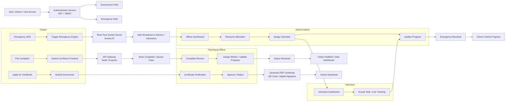

# Smart Rural Governance & Emergency Management System

This project models two connected public-service workflows:

1. Governance services for complaints and certificate processing.
2. Emergency services for SOS alerts, coordination, and field response.

The system is built around role-based access, official review, document generation, and live status tracking.

## Project Details

The application is organized around these user roles:

- Citizen: files complaints, applies for certificates, and tracks progress.
- Panchayat Officer: reviews incoming cases and verifies submissions.
- District Admin: escalates cases, assigns work, and closes service loops.
- Volunteer / Field Team: receives emergency assignments and updates live progress.

The main functional areas are:

- Complaint intake with supporting details, attachments, and location context.
- Certificate processing with document upload, verification, approval, and PDF download.
- Emergency handling with alert broadcast, resource allocation, volunteer assignment, and live tracking.
- Dashboard-based visibility for officers and citizens.

## Project Flow

### Governance Flow

1. The citizen starts at the authentication service and enters the protected dashboard flow.
2. For complaints, the citizen submits the form from the React frontend.
3. The API stores the complaint, and the officer dashboard reflects the new case.
4. The panchayat officer reviews the complaint, then assigns work or updates progress.
5. The district admin can intervene, reassign the case, and mark it resolved.
6. For certificates, the citizen submits documents for review.
7. If approved, the system generates a PDF certificate with QR-based verification and the citizen downloads it.

### Emergency Flow

1. The citizen triggers an SOS alert from the emergency entry point.
2. The emergency engine pushes the alert through the real-time socket layer.
3. Admins and volunteers receive the broadcast and open the emergency dashboard.
4. The district admin allocates resources and assigns a volunteer.
5. The volunteer accepts the task, tracks the location, and updates progress.
6. Once handled, the emergency is marked resolved and the citizen can track the outcome.

## Flow Chart



## Key Outputs

- Complaint records with attachments, categories, and progress history.
- Certificate PDFs with verification codes for public validation.
- Role-specific dashboards for citizens, officers, admins, and volunteers.
- Real-time response handling for urgent alerts and task assignment.

## Project Structure

- `client/` - user-facing application, role dashboards, complaint and certificate screens
- `server/` - API, review logic, document generation, and status handling

## Run Locally

### Backend

```bash
cd server
npm install
npm run dev
```

### Frontend

```bash
cd client
npm install
npm run dev
```

## Notes

- Add the required environment variables in `server/` before starting the backend.
- Run frontend and backend in separate terminals during development.
